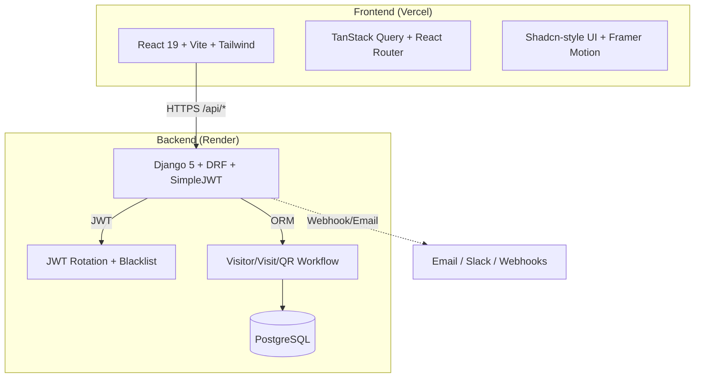

<p align="center">
  
</p>

<h1 align="center">SecureGate</h1>

<p align="center">
  <strong>Enterprise Visitor & Access Management Platform</strong>
</p>

<p align="center">
  <a href="https://secure-gate-iota.vercel.app/"></a>
  <a href="https://github.com/Mdehteshamulhaque1/Secure_Gate"></a>
  
  
</p>

<p align="center">
  <a href="#-features">Features</a> •
  <a href="#-architecture">Architecture</a> •
  <a href="#-tech-stack">Tech Stack</a> •
  <a href="#-quick-start">Quick Start</a> •
  <a href="#-deployment">Deployment</a> •
  <a href="#-project-structure">Project Structure</a> •
  <a href="#-demo-accounts">Demo Accounts</a>
</p>

---

## ✨ Features

| Area | Capabilities |
|------|--------------|
| **Authentication** | Email/password login, JWT (30 min access / 7 day refresh with rotation & blacklist), auto-refresh, account lockout after 5 failed attempts |
| **Role-Based Access** | 6 roles (Super Admin, Org Admin, Receptionist, Security, Employee, Auditor) with granular permissions |
| **Multi-Tenant** | Organization profile, buildings, floors, gates, departments, employees |
| **Visitor Workflow** | Pre-registration → Host approval → Signed QR pass → Security scan check-in/out |
| **QR Passes** | Cryptographically signed (HMAC-SHA256), expiry, single-use, duplicate detection |
| **Security Panel** | Camera QR scan + manual entry, live inside roster, blacklist alerts, emergency roster |
| **Dashboards** | Live KPIs, animated Recharts (visits trend, status breakdown), recent scans feed |
| **Reports & Analytics** | Daily/weekly/monthly, CSV export, department filter, audit log |
| **Audit Trail** | Immutable log of every action (logins, approvals, check-ins, role changes) |
| **REST API** | DRF + SimpleJWT: visitors, visits, approve/reject/check-in/out, dashboard summary |

---

## 🏗 Architecture



### Data Flow

```
1. Employee pre-registers visitor  →  POST /api/visits/register/
2. System creates Visitor + Visit (PENDING)  →  returns Visit ID
3. Host receives notification  →  GET /api/visits/?status=PENDING
4. Host approves  →  POST /api/visits/:id/approve/
5. System generates signed QR (HMAC-SHA256)  →  Visit.status = APPROVED
6. Visitor receives QR via email/link
7. Security scans QR  →  POST /api/visits/:id/checkin/
6. System verifies HMAC + expiry + single-use  →  Visit.status = CHECKED_IN
7. Visitor checks out  →  POST /api/visits/:id/checkout/
8. Audit log records every transition
```

---

## 🛠 Tech Stack

| Layer | Technologies |
|-------|--------------|
| **Frontend** | React 19, TypeScript 5, Vite 6, Tailwind CSS 4, Framer Motion 11, TanStack Query 5, React Router 7, React Hook Form + Zod, Lucide Icons, Recharts, Shadcn-style UI primitives |
| **Backend** | Django 5.2, Django REST Framework 3.15, SimpleJWT 5.4 (rotate + blacklist), dj-database-url, whitenoise, django-cors-headers, gunicorn |
| **Database** | PostgreSQL 16 (Render) • SQLite (local dev) |
| **Auth** | JWT (access 30 min, refresh 7 days, rotation + blacklist) |
| **QR** | `qrcode` library, HMAC-SHA256 signed payload (`token|signature`), expiry, single-use |
| **Charts** | Recharts (animated area chart, custom tooltips, responsive) |
| **Animations** | Framer Motion (stagger, scroll parallax, spring physics, reduced-motion support) |
| **Deployment** | Vercel (Frontend) + Render Blueprint (PostgreSQL + Web Service) |
| **CI/CD** | GitHub → Vercel/Render auto-deploy on push to `main` |

---

## 🚀 Quick Start

### Prerequisites
- Python 3.11+
- Node.js 20+
- PostgreSQL 16 (optional locally)

### Backend
```bash
cd backend
python -m venv .venv
source .venv/bin/activate          # Windows: .venv\Scripts\activate
pip install -r requirements.txt
cp .env.example .env               # edit values
python manage.py migrate
python manage.py seed_demo         # creates demo org + accounts
python manage.py runserver 127.0.0.1:8001
```

### Frontend
```bash
cd frontend
npm install
cp .env.example .env.local         # optional: VITE_API_URL=http://localhost:8001
npm run dev
```

| Service | URL |
|---------|-----|
| Frontend | http://localhost:5173 |
| Backend API | http://127.0.0.1:8001/api/ |
| Django Admin | http://127.0.0.1:8001/admin/ |

---

## 👤 Demo Accounts

| Role | Email | Password |
|------|-------|----------|
| Org Admin | `admin@acme.com` | `Secure@123` |
| Employee (Host) | `alice@acme.com` | `Secure@123` |
| Security Guard | `security@acme.com` | `Secure@123` |
| Receptionist | `reception@acme.com` | `Secure@123` |
| Employee | `bob@acme.com` | `Secure@123` |

> Console email backend prints approval emails & QR links to terminal.

---

## 🧪 Tests

```bash
# Backend
cd backend
python manage.py test visits api

# Frontend
cd frontend
npm run typecheck
npm run build
```

---

## 🚀 Deployment

### Frontend → Vercel

| Setting | Value |
|---------|-------|
| **Root Directory** | `frontend/` |
| **Framework** | Vite (auto) |
| **Build Command** | `npm run build` |
| **Output Directory** | `dist` |
| **Environment Variable** | `VITE_API_URL=https://your-api.onrender.com` |

`vercel.json` handles `/api/*` proxy to Render backend.

### Backend → Render

**Option A: Blueprint (Recommended)**
1. https://dashboard.render.com/new/blueprint
2. Connect `Mdehteshamulhaque1/Secure_Gate`
3. Render reads `render.yaml` → creates PostgreSQL + Web Service
4. Add env vars in Render Dashboard:
   - `SECRET_KEY` = `openssl rand -base64 32`
   - `CSRF_TRUSTED_ORIGINS` = `https://your-vercel-app.vercel.app`
   - `CORS_ALLOWED_ORIGINS` = `https://your-vercel-app.vercel.app`
5. First deploy → **Shell** → `python manage.py migrate && python manage.py createsuperuser`
6. Settings → **Pre-Deploy Command**: `python manage.py migrate --noinput`

**Option B: Manual Web Service**
- **Build**: `pip install -r requirements.txt && python manage.py collectstatic --noinput`
- **Start**: `gunicorn config.wsgi:application --bind 0.0.0.0:$PORT --workers 3 --timeout 60`

### Required Render Env Vars

| Key | Value |
|-----|-------|
| `SECRET_KEY` | `openssl rand -base64 32` |
| `DJANGO_DEBUG` | `False` |
| `ALLOWED_HOSTS` | `.onrender.com,yourdomain.com` |
| `CSRF_TRUSTED_ORIGINS` | `https://your-vercel-app.vercel.app` |
| `CORS_ALLOWED_ORIGINS` | `https://your-vercel-app.vercel.app` |
| `DATABASE_URL` | Auto from Render PostgreSQL |

---

## 📁 Project Structure

```
SecureGate/
├── frontend/                     # React + Vite + Tailwind
│   ├── public/
│   │   └── logo.svg              # SecureGate logo
│   ├── src/
│   │   ├── components/
│   │   │   ├── landing/          # Cinematic landing sections
│   │   │   ├── layout/           # AppShell, Sidebar, Topbar
│   │   │   ├── ui/               # Shadcn-style primitives
│   │   │   └── visitors/         # VisitorDrawer
│   │   ├── pages/                # Routes (Landing, Login, Dashboard, Visitors, Approvals, Security, Reports, RegisterVisit)
│   │   ├── hooks/                # Custom hooks
│   │   ├── lib/                  # API client, AuthProvider, queries, types, utils
│   │   ├── App.tsx               # Routes + RBAC guards
│   │   └── main.tsx
│   ├── vercel.json               # Vercel config (API proxy + SPA fallback)
│   └── .env.example
│
├── backend/                      # Django + DRF
│   ├── config/                   # Settings, URLs, WSGI/ASGI
│   ├── accounts/                 # Custom User, RBAC, JWT auth
│   ├── organizations/            # Org, Building, Department, Employee, AuditLog
│   ├── visits/                   # Visitor, Visit, QRPass, Blacklist, workflow
│   ├── reports/                  # Dashboards, reports, audit log
│   ├── api/                      # DRF ViewSets, serializers, JWT
│   ├── render.yaml               # Render Blueprint (PostgreSQL + Web Service)
│   └── .env.example
│
├── render.yaml                   # Root Render Blueprint
├── .gitignore
└── README.md
```

---

## 🔐 Security Highlights

- **JWT Rotation + Blacklist** — access tokens rotate on refresh, old tokens blacklisted
- **HMAC-Signed QR** — `token|signature`, verified server-side, tamper-proof
- **Argon2 Password Hashing** — strongest available, bcrypt fallback
- **Account Lockout** — 5 failed attempts → 15 min lock
- **CSRF + CORS** — configured for cross-origin Vercel frontend
- **Security Headers** — HSTS, CSP-ready, secure cookies in production
- **Rate Limiting** — anon 100/hr, user 1000/hr

---

## 📸 Screenshots

| Landing | Dashboard | Security Scan |
|---------|-----------|---------------|
|  |  |  |

> Add screenshots to `docs/screenshots/` to populate above.

---

## 📄 License

MIT License — see [LICENSE](LICENSE) for details.

---

## 🤝 Contributing

1. Fork the repo
2. Create feature branch (`git checkout -b feat/amazing-feature`)
3. Commit changes (`git commit -m 'feat: add amazing feature'`)
4. Push to branch (`git push origin feat/amazing-feature`)
5. Open a Pull Request

---

## 📞 Support

- **Issues**: [GitHub Issues](https://github.com/Mdehteshamulhaque1/Secure_Gate/issues)
- **Discussions**: [GitHub Discussions](https://github.com/Mdehteshamulhaque1/Secure_Gate/discussions)
- **Email**: support@securegate.io

---

<p align="center">
  Built with ❤️ by <a href="https://github.com/Mdehteshamulhaque1">Mdehteshamulhaque1</a>
</p>

<p align="center">
  
  
  
</p>